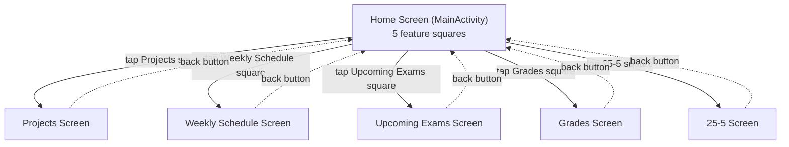
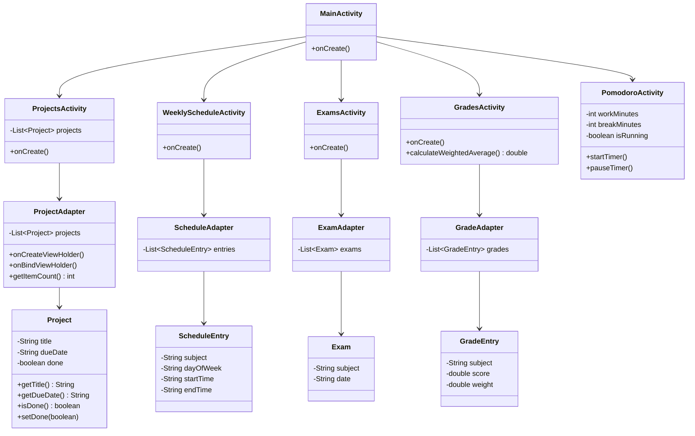

# Student Hub — Architecture (Submission 2)

Screen Flow + UML class diagram for the "Architecture folder" submission (due before Hanukkah, per
`3 ספרינט נובמבר.pdf`). Design decisions below were made together in a mentoring session and are final
for this round — next step is transcribing this into the project book (`Student Hub.docx`).

Navigation: a Home screen with one square/card per feature; tapping a square opens that feature's
screen; system back button returns to Home. Five features, five screens, five Activities.

## Decisions made

- **Framework tagging** (tracking whether a task/exam belongs to School / Academic course / External
  class): **skipped for now**. Keeps the first version simple; can be added as a field later without
  restructuring anything, once the 5 basic screens work end to end.
- **Home screen squares**, renamed from the first draft:
  - Tasks → **Projects**
  - Timetable → **Weekly Schedule**
  - Exams → **Upcoming Exams**
  - Grades → **Grades** (unchanged)
  - Timer → **25-5** (Pomodoro Technique: 25 min work / 5 min break)
- **Class naming:** underlying Java classes renamed to match the labels, not just the button text.
  Already done in code for the Projects feature (`Task` → `Project`, `TaskAdapter` → `ProjectAdapter`,
  `item_task.xml` → `item_project.xml`, `R.id.taskRecyclerView` → `R.id.projectRecyclerView`), verified
  with a clean `git mv` + rename and a successful `./gradlew compileDebugJavaWithJavac`.
  - The "25-5" button is a label only — `25-5Activity` isn't a legal Java class name (can't start with
    a digit or contain a hyphen). Internal class name: **`PomodoroActivity`**, named after the actual
    technique so the code stays clear to read later even though the button just says "25-5."

## 1. Screen Flow

Solid arrows = user taps a square. Dashed arrows = system back button (default Activity back-stack
behavior — no extra code needed).

## 2. UML Class Diagram

## Status vs. the code today

- `Project`, `ProjectAdapter`, `item_project.xml` exist and work (Big 4 pattern, dummy data, verified
  scrolling + recycling in Logcat).
- `MainActivity` currently shows the Projects list **directly** — it is not yet the 5-square Home hub.
  That split (moving the list into a new `ProjectsActivity`, turning `MainActivity` into the launcher)
  is the next real refactor, not done yet.
- `ScheduleEntry`/`ScheduleAdapter`, `Exam`/`ExamAdapter`, `GradeEntry`/`GradeAdapter`,
  `PomodoroActivity`, `WeeklyScheduleActivity`, `ExamsActivity`, `GradesActivity` — none of these exist
  in code yet. They're diagram-only until built.

## Next steps

1. Get this diagram into the actual project book (`Student Hub.docx`) — redraw cleanly in draw.io (the
   sprint doc's suggested tool) or export/screenshot this Mermaid version.
2. Commit + push current work to GitHub (required by the sprint doc's hands-on section).
3. When ready to keep building: split `MainActivity` into the Home hub + `ProjectsActivity`, then pick
   one more feature to build with the same Big 4 pattern.
